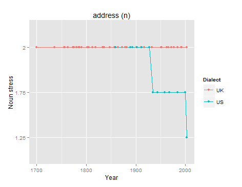

# StressChange

This project uses the [MASON simulation toolkit](https://cs.gmu.edu/~eclab/projects/mason/) to implement 5 language change models for the stress shift in English N/V pairs. 

The 5 models come from Sonderegger and Niyogi (2010) [*Combining data and mathematical models of language change*](http://www.aclweb.org/anthology/P/P10/P10-1104.pdf).

## Installation

This code was prepared and tested with Java 8.

No installation or compiling is required. The `dist` folder includes jar files for the main StressChange classes and the dependencies `mason.19.jar` and `commons-cli-1.3.1.jar`.

## Usage

You can run the code from the command line as follows:

`java -jar dist/stressChange.jar -model mistransmission -mode deterministic -distModel none -logging some -priorClass none -nounFreq 1000 -verbFreq 1000`

The options are the following:

```
java -jar dist/stressChange.jar -model      [ mitransmission | constraint | constraintWithMistransmission | prior | priorWithMistransmission ] 
                                -mode       [ deterministic | stochastic ] 
                                -distModel  [ none | random | absolute | probabilistic | grouped ] 
                                -logging    [ some | all ]
                                -priorClass [ none | prefix ]
                                -nounFreq   [ 1000 ]
                                -verbFreq   [ 1000 ]
```

If no option is given, the first option listed is the default.

## Overview

### Stress in English N/V pairs

English has many word pairs where the noun and verb forms are identical except for syllable stress, for example *per*mit (n) vs. per*mit* (v).

### Change over time

The stress patterns of these N/V pairs has been shown to change over time. Sonderegger (2009) compiled entries for 149 N/V pairs from British and American dictionaries from around 1500 to today. 

### Observed properties

Based on the diachronic observations in the N/V pair data, Sonderegger and Niyogi (2010) derive 6 properties (or "observed dynamics") of the stress pattern language change:

1. *Unstable state* - No N/V pair is observed with a {2,1} stress pattern
2. *Stable states* - Stress patterns {1,1}, {1,2} and {2,2} are all observed in the historical data
3. *Observed stable variation* - States are observed where either the N or V varies over time, but not both
4. *Sudden change* - Change can happen from one stress pattern to another
5. *Observed changes* - There are four observed changes: {1,1} &harr; {1,2} and {2,2} &harr; {1,2}
6. *Observed frequency dependence* - Change to {1,2} corresponds to a decrease in the frequency of N

(Sonderegger and Niyogi 2010, p. 1023)

The dynamical systems models in Sonderegger and Niyogi (2010) are evaluated based on whether they fulfill these observed properties.

Sonderegger (2009) made the additional observation that word pairs with the same prefix (e.g. *re-* or *de-*) have similar trajectories. And in our analysis of the data, we observed some examples of variation between stress patterns in US and UK dictionaries, for example with the noun form of *address*:



In this figure, a y-value of 2 means only secondary stress, 1.75 means mostly secondary stress and 1.25 means mostly primary stress. You can see that US dictionaries show a change toward primary stress for *address* starting around 1935, whereas UK dictionaries continue to show only secondary stress.

For this reason, we've added two observed properties:

7. *Analogical change* - N/V pairs with same prefix tend to have the same stress pattern
8. *Dialectical divergence* - N/V pair trajectories can diverge between distant groups of speakers

## Baseline Models

The baseline models from Sonderegger and Niyogi (2010) have specific characteristics:

1. Each generation is discrete
2. Speakers in G<sub>t</sub> learn from speakers in the parent generation G<sub>t-1</sub> 
3. Every speaker learns from every parent
4. Each generation has infinite speakers (this constraint could not be met in this code)

(Sonderegger and Niyogi 2010, p. 1022)

### 1. Mistransmission

`java -jar dist/stressChange.jar -model mistransmission`

The first model is based on the assumption that language change often occurs in the "handover" between generations due to mistransmission. That is, speakers sometimes mishear what the parent generation says, influencing the language that they end up speaking.

In the context of the N/V stress patterns for these verbs, there is a clear bias toward a {1,2} stress pattern, known as Ross' generalization. One explanation for this bias is that generally in English stressed and unstressed syllables appear alternately in a sentence. As nouns often follow an unstressed article (a "trochaic-biasing" context), they tend to have primary stress. Because of this tendency, Sonderegger and Niyogi (2010) assume that mistransmission can occur in only one direction ({1,1}, {2,2} &rarr; {1,2}). 

Using the following definitions:

* &alpha; = generation average probability of pronouncing N as second stress
* &beta; = generation average probability of pronouncing V as second stress
* *p* = mistransmission probability for N
* *q* = mistransmission probability for V

The evolution equation for Model 1 is then:

*&alpha;<sub>t</sub> = &alpha;<sub>t-1</sub> (1 - p)*

*&beta;<sub>t</sub> = &beta;<sub>t-1</sub> + (1 - &beta;<sub>t-1</sub>) q*

The assymetry in the evolution equation ensures that &alpha; tends toward 0, that is decreases the probability of a second-stress N, and &beta; then tends toward 1, that is increases the probability of a second-stress V.

```java
    public double getMisNoun(double p, double alphaPrev) {
        double alpha = alphaPrev * (1 - p);
        return alpha;
    }

    public double getMisVerb(double q, double betaPrev) {
        double beta = betaPrev + ((1 - betaPrev) * q);
        return beta;
    }

    public void mistransmission(WordPair word) { // Model 1
        // set the noun and verb probabilities for the next generation
        
        word.nextNounProb = getMisNoun(word.misNounPrev, word.avgParentNounProb); // update noun probabilities
        word.nextVerbProb = getMisVerb(word.misVerbPrev, word.avgParentVerbProb); // update verb probabilities
    }
```

All N/V pairs converge to the {1,2} stress pattern in this model.

### 2. Coupling by constraint

`java -jar dist/stressChange.jar -model constraint`

The coupling by constraint model takes a different approach and assumes a simple *constraint* based on Ross' Generalization that the probability of a second-stress N must be less than the probability of a second-stress V for a specific word pair.

```java
    public void constraint(WordPair word) { // Model 2
        // updates noun and verb probabilities based on constraint only

        if (word.avgParentNounProb < word.avgParentVerbProb) { // if constraint is met, then estimate equals expectation
            word.nextNounProb = word.avgParentNounProb;
            word.nextVerbProb = word.avgParentVerbProb;
        } else {
            word.nextNounProb = (word.avgParentNounProb + word.avgParentVerbProb) / 2; // if constraint is not met, then estimate equals average of expectations
            word.nextVerbProb = (word.avgParentNounProb + word.avgParentVerbProb) / 2;
        }
    }
```

All N/V pairs with stress patterns satisfy this constraint do not show any change, while any patterns where the N probability of second-stress is higher than the V probability converge until the constraint is met, usually when the N and V probabilities of second-stress are equal.

### 3. Coupling by constraint, with mistransmission

`java -jar dist/stressChange.jar -model constraintWithMistransmission`

This model combines the coupling by constraint but includes mistransmission for the "heard" examples between generations.

```java
    public void constraintWithMistransmission(WordPair word) { // Model 3
        // the same as constraint(), but on "heard" examples (i.e. mistransmission)
        mistransmission(word);
        constraint(word);
    }
```

With this model, the mistransmission updates guarantee that all N/V pairs converge to a {1,2} stress pattern.

### 4. Coupling by priors

`java -jar dist/stressChange.jar -model prior`

Using prior probabilities as well as observed likelihoods allows information about the lexicon in general to affect how a specific word pair's stress pattern changes over time. As with a Bayesian approach, the prior represents knowledge of stress patterns in general (e.g. that {2,1} never occurs), while the observed likelihood is based on what speakers hear from the previous generation.

```java
    public void prior(WordPair word) { // Model 4

        // calculate learned probabilities (P) based on word frequencies sampled from parent probabilities
        double kNoun = 0.0; // number of nouns heard as final stress
        double kVerb = 0.0; // number of verbs heard as final stress
                
        for (int i = 0; i < word.freqNoun; i++) {
            if (speakers.random.nextDouble() <= word.nextNounProb) {
                kNoun++;
            }
        }

        for (int i = 0; i < word.freqVerb; i++) {
            if (speakers.random.nextDouble() <= word.nextVerbProb) {
                kVerb++;
            }
        }

        double p11 = ((word.freqNoun - kNoun) / word.freqNoun) * ((word.freqVerb - kVerb) / word.freqVerb);
        double p12 = ((word.freqNoun - kNoun) / word.freqNoun) * (kVerb / word.freqVerb);
        double p21 = (kNoun / word.freqNoun) * ((word.freqVerb - kVerb) / word.freqVerb);
        double p22 = (kNoun / word.freqNoun) * (kVerb / word.freqVerb);

        // Set fixed lambda values, must sum to 1
        double lambda11 = 0.2;
        double lambda12 = 0.4;
        double lambda21 = 0.0; // this one should always be 0.0
        double lambda22 = 0.4;
        
        // update current noun and verb probabilities based on learned and prior probabilities
        word.nextNounProb = ((lambda21 * p21) + (lambda22 * p22)) / ((lambda11 * p11) + (lambda12 * p12) + (lambda21 * p21) + (lambda22 * p22));
        word.nextVerbProb = ((lambda12 * p12) + (lambda22 * p22)) / ((lambda11 * p11) + (lambda12 * p12) + (lambda21 * p21) + (lambda22 * p22));
    }
```

In this model, the stress patterns that word pairs converge to depends mostly on the lambda (prior) probabilities. However, likelihoods of 0.0 probability will of course rule out specific stress patterns, just as the lambda probability of 0.0 for the stress pattern {2,1} guarantees that it will never occur.

### 5. Coupling by priors, with mistransmission

`java -jar dist/stressChange.jar -model priorWithMistransmission`

This model includes the prior probabilities of Mode 4, but applies the updates between generations to the "mistransmitted" examples.

```java
    public void priorWithMistransmission(WordPair word) {
        // the same as prior(), but on "heard" examples (i.e. mistransmission)
        mistransmission(word);
        prior(word);
    }
```

## Additions

A few optional features have been added for simulations beyond what's included in Sonderegger and Niyogi (2010):

1. *Stochasticity* - Sample from parent probabilities rather than taking them directly
2. *Distance* - In the MASON 2D field, speakers only learn from parents within a specified distance
3. *Prefixes* - In models 4 and 5, the prior probabilities are derived from the prefix class of a pair, if applicable

### 1. Stochasticity

`-mode stochastic`

The deterministic models use exact probabilities between generations (default setting), while stochastic models sample from a probability distribution, allowing for a small amount of randomness.

### 2. Distance

#### None

With this default setting, no special restrictions are placed on distance, i.e. everyone speaks to everyone.

#### Random

`-distModel random`

With the random setting, each speaker speaks to half the total number of parents, chosen randomly.

#### Absolute

`-distModel absolute`

With the absolute setting, each speaker speaks to parents located within a specific maximum distance.

#### Probabilistic

`-distModel probabilistic`

With the probabilistic setting, whether a speaker speaks to a parent is decided by a sampling a probability based on the distance, i.e. the farther away a parent is, the less like a speaker will speak to them.

#### Grouped

`-distModel grouped`

With the grouped setting, speakers are initially placed into two separate groups, allowing diverting trajectories over time.

### 3. Prefixes

`-priorClass prefix`

Using prefix classes allows having prior probabilities set per prefix class, rather than for the lexicon as a whole. This allows for representing similarities at a more fine-grained level, consistent with the observed property that word pairs with the same prefix tend to have similar stress patterns. With this setting, the prior probabilities (lambdas) are caculated based on the initial stress patterns *per prefix class*. For example, word pairs with the prefix *out* have prior probabilities of {1,2} = 0.9 and {2,2} = 0.1, while pairs with the prefix *pre* have {1,1} = 0.2, {1,2} = 0.4 and {2,2} = 0.4. If a word pair does not have a specific prefix (e.g. *affect*), the prior probabilities are caculated from the lexicon as a whole, that is {1,1} = 0.09, {1,2} = 0.43 and {2,2} = 0.48.

Without this option, all word pairs have the same prior probabilities, which can be set in the code.

## Results

* How do the agent-based models compare to the baseline dynamical systems models in general?
* Which models and combitations of agent-based additions fulfill the additional properties?

## References

Niyogi, P. (2006). *The computational nature of language learning and evolution*. Cambridge, MA:: MIT press.

Sonderegger, M. (2009). "Dynamical systems models of language variation and change: An application to an English stress shift." *Masters paper, Department of Computer Science, University of Chicago.*

Sonderegger, M., & Niyogi, P. (2010, July). "Combining data and mathematical models of language change." In *Proceedings of the 48th Annual Meeting of the Association for Computational Linguistics* (pp. 1019-1029). Association for Computational Linguistics.
